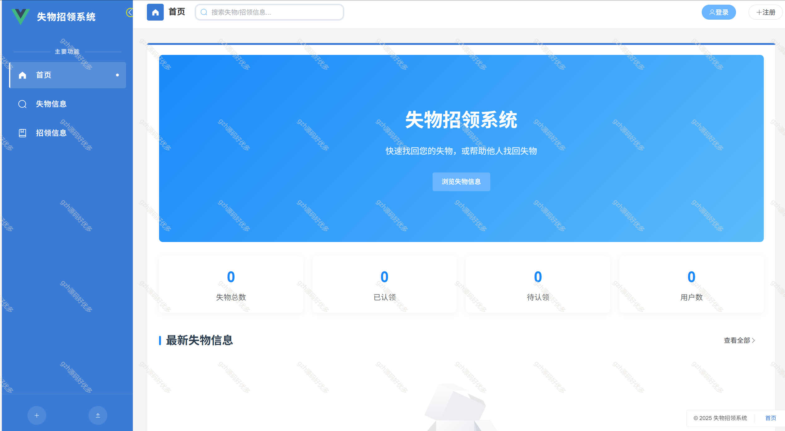
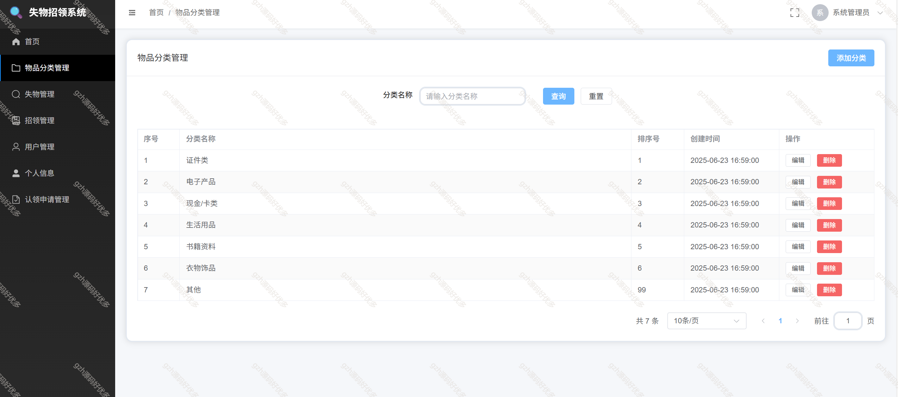
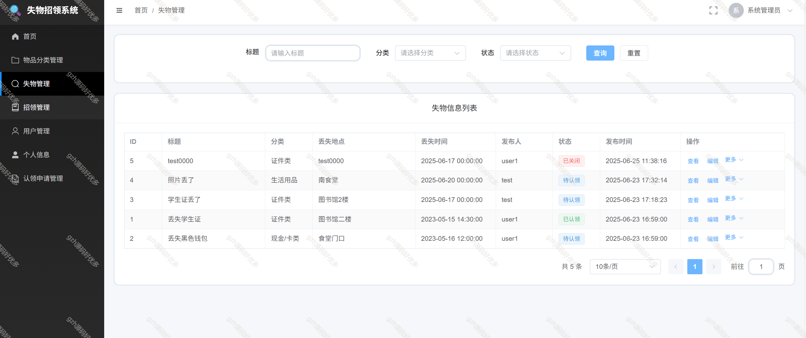
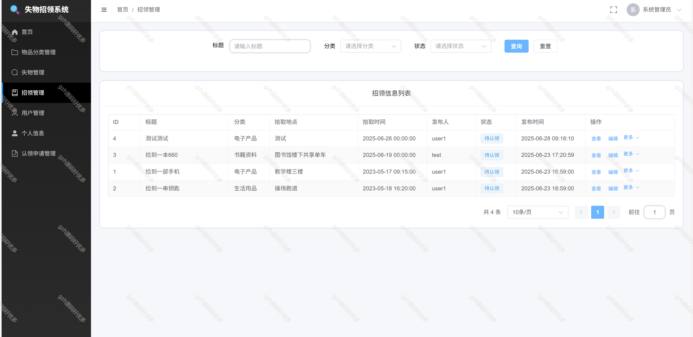
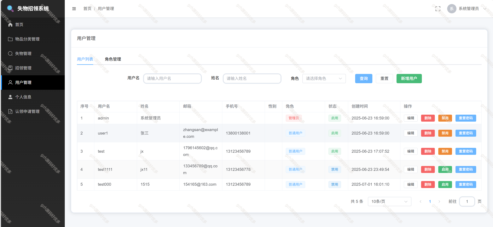
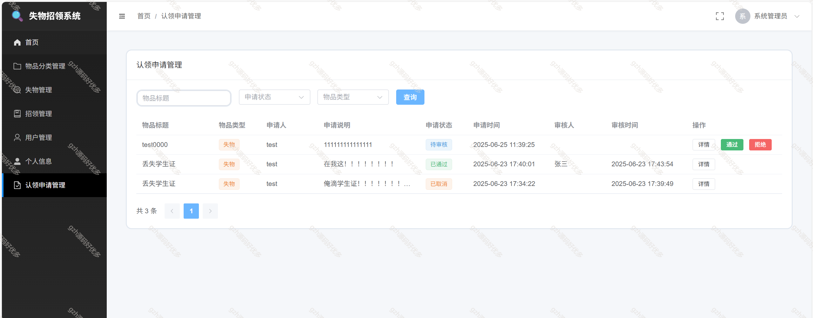
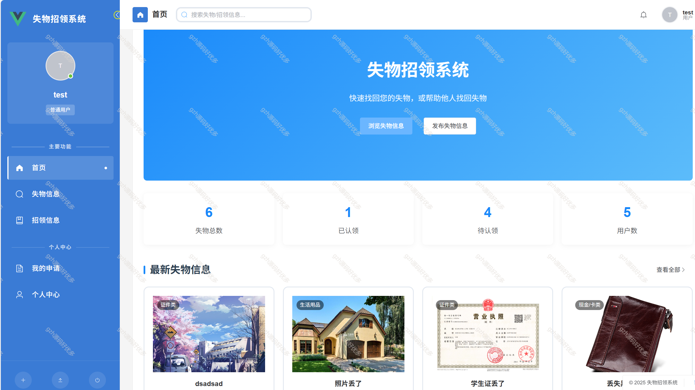
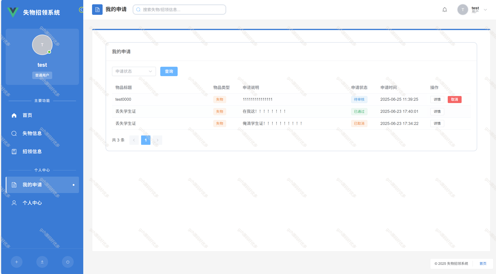

# springbootA527
springbootA527失物招领系统+讲解文档（Vue3）
 
## 查看主页获取源码

### 一、关键词

失物招领，失物招领系统。

### 二、作品包含

源码+数据库+全套环境和工具资源+部署教程

### 三、项目技术

前端技术：Vue3、Element Plus+Vite
数据库：MySQL
后端技术：Java、SpringBoot3.0、MyBatis-Plus

### 四、运行环境(以下版本亲测，其他版本未知，请自测)

开发工具：IDEA/eclipse  + vscode

数据库：MySQL5.7 （最低要5.7版本）

数据库管理工具：Navicat10以上版本

环境配置软件： JDK17 + Maven3.6.3

前端Nodejs：16

浏览器：谷歌浏览器

### 五、项目介绍

项目编号：springbootA527

失物招领系统是借助信息化技术搭建的，用于管理和处理失物及招领事务的平台，能方便失主找回物品，也能帮助拾得者妥善处理捡到的物品，常见于学校、机场、车站、商场等人员流动大的场所。
系统模块
    用户管理模块
    失物管理模块
    招领管理模块
    认领申请模块

### 六、运行截图

